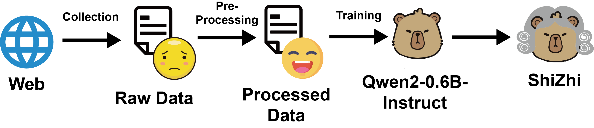
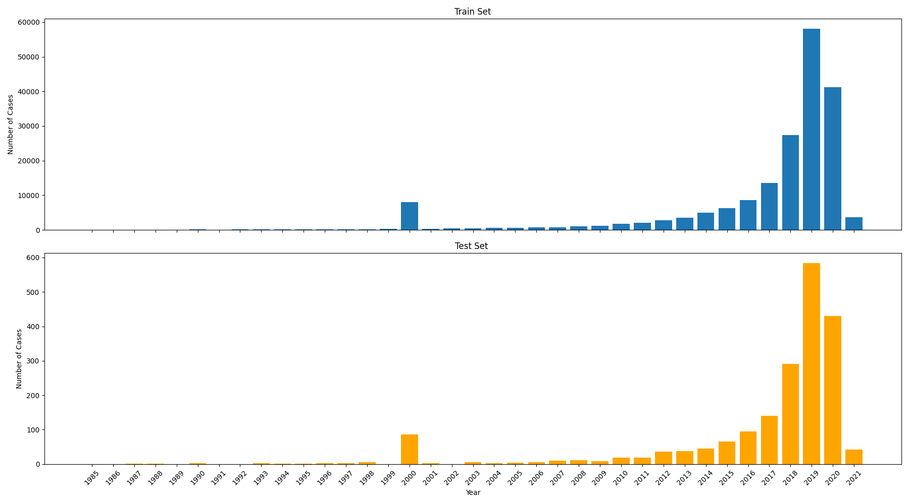
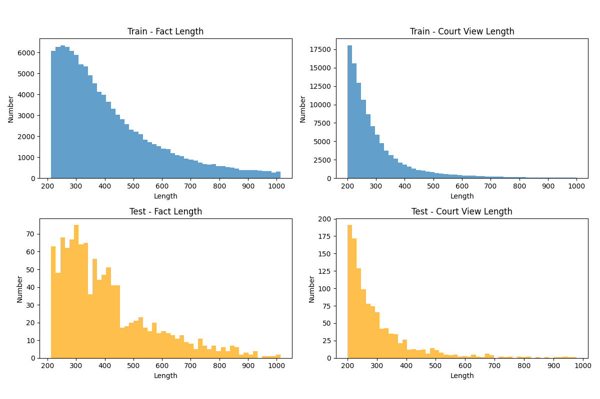
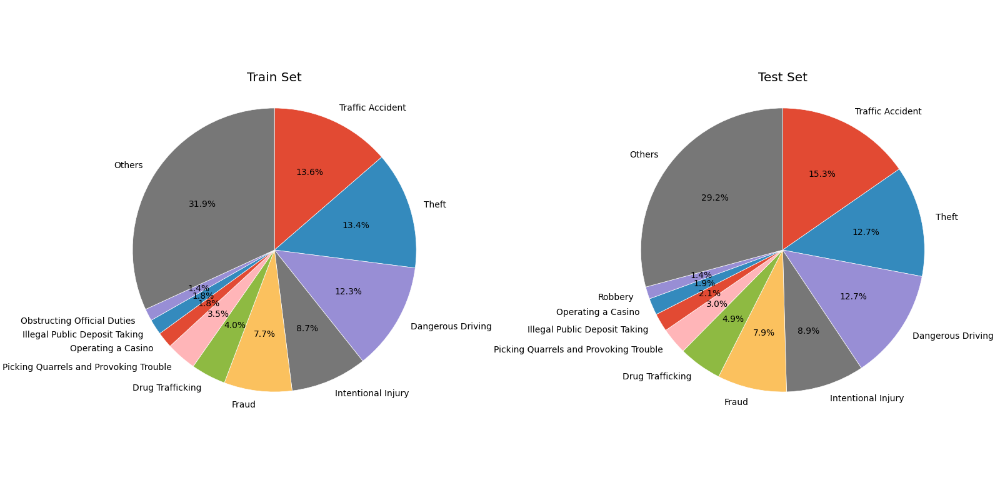

<p align="center">
  
</p>

# ShiZhi: A Lightweight Large Model for Court View Generation

<p align="center">
  <a href="https://arxiv.org/abs/2510.09297">
    
  </a>
  <a href="https://huggingface.co/TIM0927/ShiZhi">
    
  </a>
  <a href="https://huggingface.co/datasets/TIM0927/CCVG">
    
  </a>
  <a href="https://modelscope.cn/models/freshman8888/LegalReasoningModel">
    
  </a>
  <a href="https://www.modelscope.cn/datasets/ZhitianHou/CCVG">
    
  </a>
</p>

**ShiZhi (释之)** is a lightweight large language model designed for **Criminal Court View Generation (CVG)** in Chinese.  
Its name comes from the historical figure **Zhang Shizhi (张释之)**, and in Chinese, “释之” also conveys the meaning of “explaining” or “interpreting,” which is particularly suitable for generating the *court view* section in legal case documents.

---

## ⚙️ Model Training

ShiZhi is fine-tuned on the **CCVG** dataset using a 0.5B-parameter instruction-tuned LLM as the base model.  
The training pipeline includes data curation, prompt construction, and instruction tuning tailored for CVG and charge prediction tasks.  

<p align="center">
  
</p>

### Quick Start
If you want to reproduce our experiments, you can follow these steps:
1. Clone repository
```bash
git clone https://github.com/ZhitianHou/ShiZhi.git
```

2. Download base-model from modelscope
```bash
modelscope download --model qwen/Qwen2-0.5B-Instruct --local_dir /path/to/your/base/model
```

3. Install swift-2.34.0
```bash
pip install swift==2.34.0
```

4. Training Model and Inference
```bash
cd ShiZhi
python train.py
```

If you want to use latest version of swift for training, please use:
```bash
pip install swift
bash train.sh
```

5. Evaluation 
```bash
python evaluation.py
```

## 📊 Model Performance

The performance of ShiZhi on **court view generation** and **charge prediction** is summarized below:

| **Models** | **ROUGE-1** | **ROUGE-2** | **ROUGE-L** | **BLEU-1** | **BLEU-2** | **BLEU-N** | **Accuracy** | **Macro-F1** |
|-------------|-------------|-------------|-------------|-------------|-------------|-------------|---------------|---------------|
| Qwen2-0.5B-Instruct | 24.18 | 6.53 | 16.40 | 29.16 | 17.11 | 9.24 | 16.29 | 28.02 |
| **ShiZhi** | **70.00** | **51.07** | **59.61** | **67.85** | **62.92** | **54.76** | **86.48** | **92.75** |

ShiZhi substantially outperforms the base model across both **BLEU/ROUGE** metrics and **charge prediction (Accuracy, Macro-F1)**.

## 📚 Dataset: CCVG

ShiZhi is trained on **CCVG**, a curated dataset of over **110K Chinese criminal cases**.  Each case includes a **fact description** and its corresponding **court view**, supporting both **court view generation** and **charge prediction** tasks. Below are some **visualizations of the dataset**, including examples of fact–court view pairs and length statistics.

<p align="center">
  <br/>
  <br/>
  
</p>

---

## 📖 Citation
If you find this project helpful, please consider citing our paper:
```bibtex
@misc{hou2025shizhichineselightweightlarge,
      title={ShiZhi: A Chinese Lightweight Large Language Model for Court View Generation}, 
      author={Zhitian Hou and Kun Zeng},
      year={2025},
      eprint={2510.09297},
      archivePrefix={arXiv},
      primaryClass={cs.CL},
      url={https://arxiv.org/abs/2510.09297}, 
}
```
